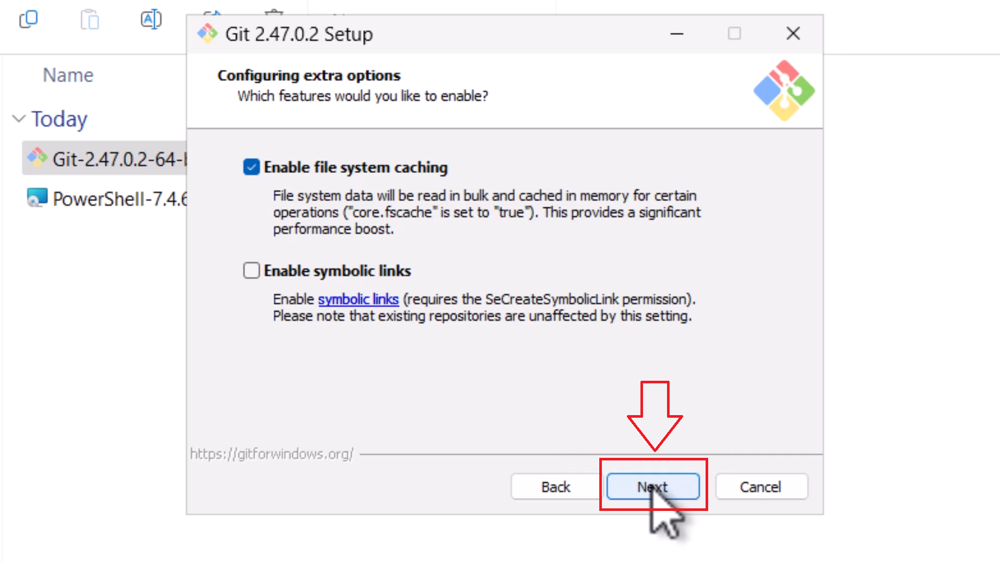

# Instalacja Gita

W tej części krok po kroku przejdziemy przez etap instalacji Gita na Windowsie. Później skonfigurujemy konto użytkownika, aż na końcu utworzymy sobie repozytorium lokalne.

---

## Wejdź na stronę:
- [https://git-scm.com/downloads](https://git-scm.com/downloads)

### Etap 1 - strona pliku instalacyjnego

### Etap 2 - pobranie pliku instalacyjnego

### Etap 3 - akceptacja regulaminu (Standard)

### Etap 4 - wybranie lokalizacji zainstalowania Gita (Opcjonalne)

### Etap 5 - Wybranie komponentów (Opcjonalne)

### Etap 6 - Wybranie start menu folder (Standard)

### Etap 7 - Wybór domyślnego edytora Git (Opcjonalne)

### Etap 8 - Wybór nazwy głównego brancha repo (Opcjonalne)

### Etap 9 - Wybór ścieżki  (Opcjonalne)

### Etap 10 - Wybór klienta SSH

### Etap 11 - Wybór backendu HTTPS

### Etap 12 - Line endings

### Etap 13 - Terminal emulator (Opcjonalne)

### Etap 14 - Zachowanie "git pull"

### Etap 15 - Dodatkowe opcje

### Etap 16 - Zakończenie konfiguracji instalatora, instalacja

## Po zakończeniu instalacji przejdź do kolejnego kroku — [Konfiguracja Gita](konfiguracja.md).